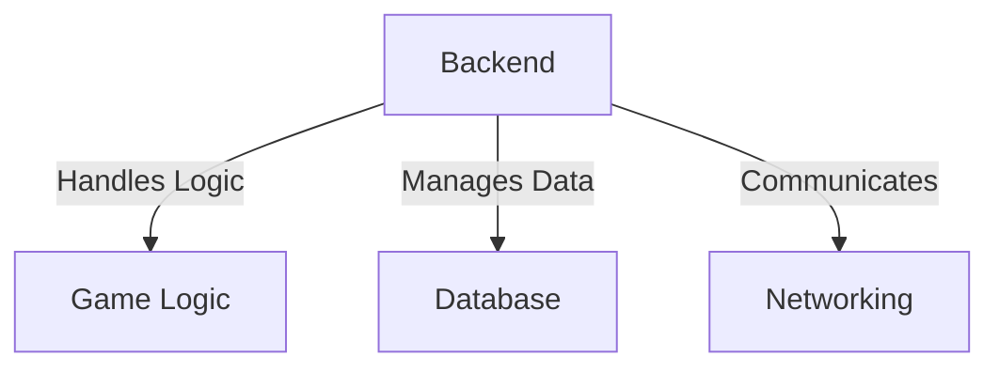
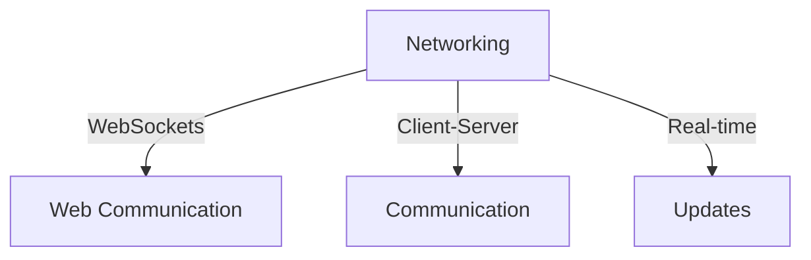
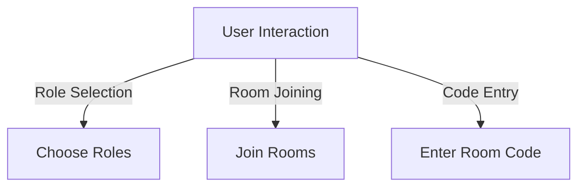
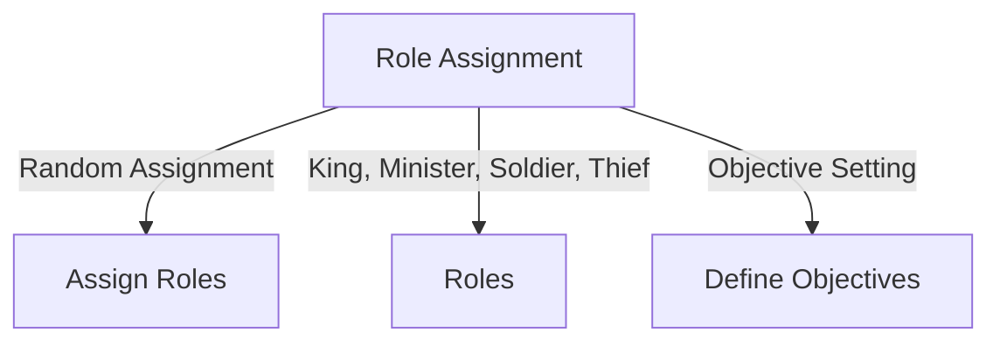

# Backend Diagram


```mermaid
graph TD
    A[Frontend] -->|User Interface| B[UI Design]
    A -->|Real-time Updates| C[Socket.IO]
    A -->|Interactive| D[User Interaction]
  ```

  ```mermaid
  graph TD
    A[Database] -->|User Information| B[User Data]
    A -->|Game State| C[Game Data]
    A -->|Role Assignment| D[Roles]
```






```mermaid
graph TD
    A[Project Overview] -->|Multiplayer Game| B[Game Concept]
    A -->|Role Dynamics| C[Role Assignment]
    A -->|Technology Stack| D[Technologies Used]
    A -->|Game Flow| E[Player Interactions]
  ```

  ```mermaid
  
graph LR
    A[Client] -->|Socket.IO| B[Frontend Server]
    B -->|Flask-SocketIO| C[Backend Server]
```